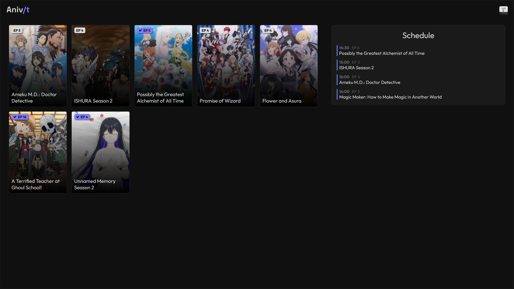

<div align="center">
  
  <h3>Your anime media server</h2>
</div>

----

<div align="center">
  
</div>

<br>

> [!IMPORTANT]
> Aniv/t is intended for **personal use** and personal use only. \
> Aniv/t and its developer do not host, store or distribute \
> any content that is not publicly available *(such as cover images)*. \
> This project does not endorse or promote piracy in any form. \
> It is the user's responsibility to ensure that they are in compliance with their local laws and regulations.

## What is Aniv/t?
Aniv/t is a **media server** with a web interface, auto downloader, AniList sync and more.

## Planned features
- Dashboard with config menu.
- Onboarding process.
- Watchlist.
- Anime Search.
- On-demand downloading.
- Anime recommendations.
- Related anime.
- Editable website theme.

## Will ___ be added?
Maybe. This is a one-person project made to suit my personal use case. \
There are also some features that I want to add and for now, that will be my priority. \
I will still try to address all bugs and issues.

## How does it work?
Aniv/t looks for new episodes of anime series that you watch in configured RSS feeds and automatically downloads and encodes them.
After you watch an episode it marks it as watched in your AniList and deletes the file after set time.

## How do i set it up?

> [!NOTE]
> For now, there is no wiki or documentation so you will have to make do with this.

The recommended way of running Aniv/t is in a docker container. 
You can find the dockerfile and docker-compose.yml in the repo.

After you build and start the container you will need to change some settings in config.json.
Here are the settings that need to be changed:

- "secret" - This is the secret key for flask sessions. Set it to something long and hard to guess.
- "redirect_base" - This is the URL to your instance. typically http://[ip of your server]:[port]
- "cid" - This is the client ID of your AniList API client.
- "secret" - This is the secret of your AniList API client.

As you probably noticed some of the settings require an AniList API client. 
You can create one [here](https://anilist.co/settings/developer).
Make sure to set the redirect URL to the same value as in the config.json.

The only thing left is to add some RSS feeds.
This is the schema for adding RSS feeds in the config file:
```
"rss": [
    {
        "url": "...",
        "regex": "...",
        "per_season_episodes": false/true
    }
]
```
- "url" - Url to RSS feed with torrent files.
- "regex" - Regex expression matching two groups - title and episode number.
- "per_season_episodes" - Some providers may count episodes globally and not per season *(S2E6 -> E18)*. Make sure to set this to true if that is the case.

If you don't know where to find RSS feeds r/Piracy is your friend.
If you don't know how to create a regex expression you can usually get it done with ChatGPT, make sure to escape all "\\" symbols *(e.g., \\d+ → \\\\d+ in JSON)* in the config file.
