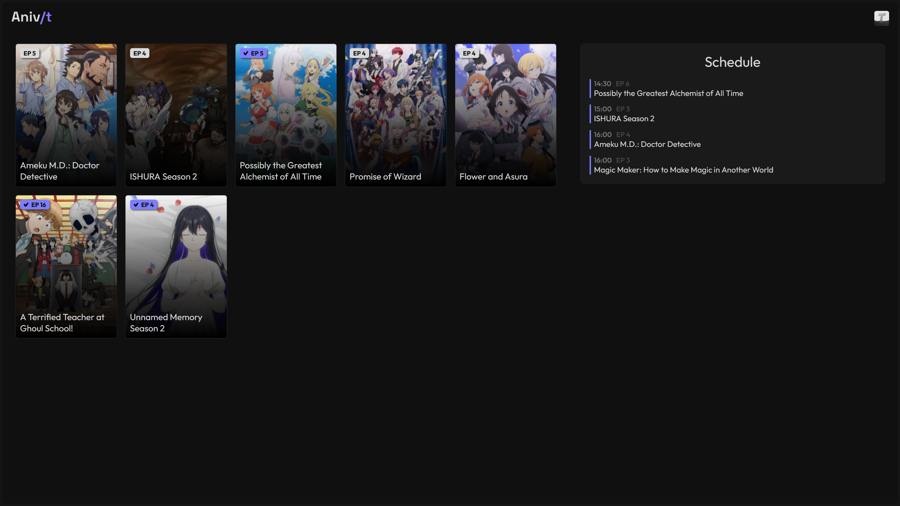

<div align="center">
  
  <h3>Your anime media server</h2>
</div>

---

<div align="center">
  
</div>

<br>

> [!IMPORTANT]
> Aniv/t is intended for **personal use** and personal use only. \
> Aniv/t and its developer do not host, store or distribute \
> any content that is not publicly available _(such as cover images)_. \
> This project does not endorse or promote piracy in any form. \
> It is the user's responsibility to ensure that they are in compliance with their local laws and regulations.

## What is Aniv/t?

Aniv/t is a **media server** with a web interface, auto downloader, and AniList sync.

## Planned features

- Onboarding
- Watchlist
- Search
- On-demand downloading
- Anime recommendations
- Editable website theme

## How does it work?

Aniv/t scans for new episodes of an anime series that you mark as planned or watchin in AniList.
When a configured RSS feeds has a matching episdes the app automatically downloads and encodes it.
After an episode is watches it gets marked as so in AniList and after a set amount of time the file gets removed.

## Installation

The recommended way of running Aniv/t is in a docker container.
The dockerfile and docker-compose.yml can be found in the repo.

After the initial run of the container a configuration file is generated at `./configs/config.yml`.
The following settings must be configured:

```yaml
anilist:
    # The URL of your instance. Typically http://[Server IP]:[Port]
    redirect_base: '...'
    # AniList API client ID.
    cid: '...'
    # AniList API client secret.
    secret: '...'
```

It's also possible to set those settings via environment variables:

```bash
ANILIST_REDIRECT=...
ANILIST_CID=...
ANILIST_SECRET=...
```

The AniList API client can be created [here](https://anilist.co/settings/developer).
The redirect URL must match the config entry exactly.

For the server to function properly RSS feeds must be configured in the settings.
